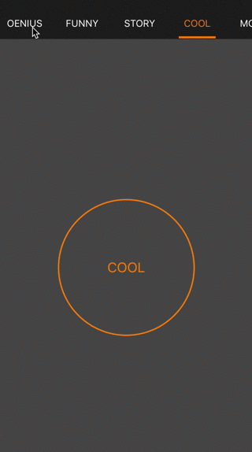

PageController
==================

Infinite paging controller, scrolling through contents and title bar scrolls with a delay. Written in Swift. 
It also provide fully options to customise your own UI's needs.



Requirements
----------
- iOS 7.0+
- Xcode 6.0+

PageController | Xcode | Swift | travis-ci
----------- | ----- | ----- | ---------
0.2.0 | 6.4 | 1.2 | [](https://travis-ci.org/hirohisa/PageController)
0.3.x | 7.0+ | 2.0 | [](https://travis-ci.org/hirohisa/PageController)

* Swift 2.0 Support

Features
----------

- [x] Swift version
- [x] Infinite scroll option 
- [x] Support options setting like menu color, menu font, and also insets
- [x] Support controller action such viewwillapear etc.
- [x] Support menu bar which can be used alone


How to use
----------

extension or init, both way supported

```swift
override func viewDidLoad() {
    super.viewDidLoad()
    UIApplication.sharedApplication().statusBarHidden = true
    view.backgroundColor = UIColor.yellowColor()
    
    let titles: [String] = [
      "HAPPY",
      "FOOD",
      "OENIUS",
      "FUNNY",
      "STORY",
      "COOL",
      "MOOD",
    ]
    
    let controllers = titles.map { (title) -> UIViewController in
      let v = UIViewController()
      v.title = title
      return v
    }
    
    self.controllerArr = controllers;
    
    self.configOptions = ConfigOptions(
      pageMenuOptions:
      [
        .SelectedColor(UIColor.orangeColor()),
        .NormalColor(UIColor.whiteColor()),
        .IndicatorColor(UIColor.orangeColor()),
        .MenuColor(UIColor(red: 30.0 / 255, green: 30.0 / 255, blue: 30.0 / 255, alpha: 1)),
      ]
    )
  }

```

License
-------
	Copyright 2015 Oenius Jou
	
	Licensed under the Apache License, Version 2.0 (the "License");
	you may not use this file except in compliance with the License.
	You may obtain a copy of the License at
	
	    http://www.apache.org/licenses/LICENSE-2.0
	
	Unless required by applicable law or agreed to in writing, software
	distributed under the License is distributed on an "AS IS" BASIS,
	WITHOUT WARRANTIES OR CONDITIONS OF ANY KIND, either express or implied.
	See the License for the specific language governing permissions and
	limitations under the License.
